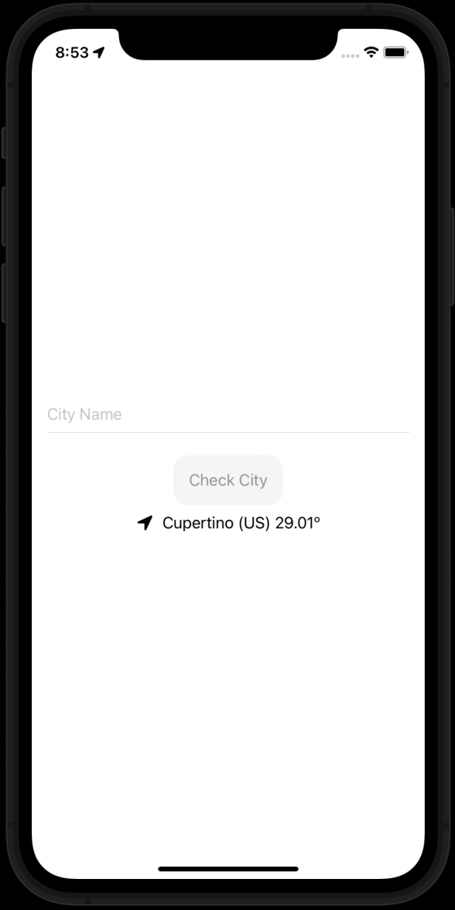
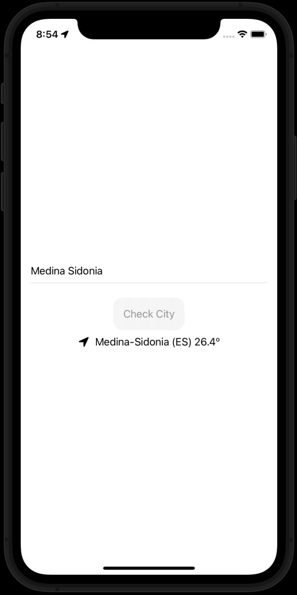

# Check Current Weather

Hey there!!

After posting my version of a weather mobile app, that originaly called iWeather 😆, I wanted to spend sometime on working with Core Location to obtain the users' current location, so that I could provide them with the weather information. At the same time, I had the chance to experiment with Async/Await in order to deal with asyncronous operations when requesting information from the weather API. I have to say that working with Async/Await makes working with asynchronous operartion much easier and intuitive than before.

The way this app works is not a rocket science, the main screen just has a text field, where the user can enter the name of the place he wants to check or, in case wanting to check his current location, he can just pressing the button withour inserting any city name. One the button is tapped, the app will show the result with a little animation, removing that information fromt the screen in a few seconds latter.

###### Main View Empty

###### Main View showing the weather of the current location

###### Main View showing the weather of the given location

## Skills

1. **MVVM Pattern**: to struct the application decoupling views from models and avoiding oversized controllers.
2. **Async/Await**: to simplify the way work with asynchronous processes like requestion information from an API.
3. **ObservableObject protocol**: to allow information to go from one part of the app to another updating the views as fast as any of the object property is modified.
4. **Codable protocol**: which makes coding and decoding the information coming from the wehather API be almost automatic.

## To improve
1. When I insert some custom locations, the city name retrieved by Core Location does not match the requirements of the weather API as they contain numbers in the name. This happens in cities like Dublin where Core Location returns the name of the district (Dublin 15). One way to solve this could be using Regular Expression to extract every character that it is not a number.

